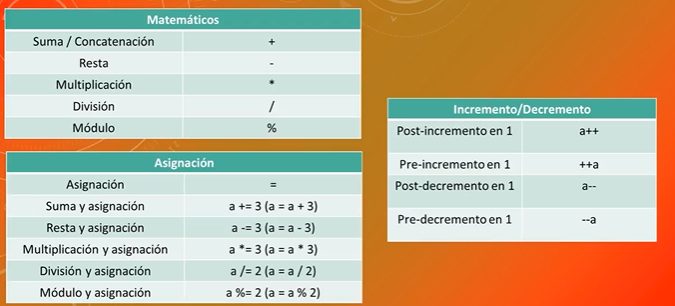

# CURSO DE JAVASCRIPT UDEMY

## HISTORIA DE JAVASCRIPT

- Javascript es un lenguaje de programacion.
- Lo creo Brendan Eich.
- Es el unico lenguaje de programacion que puede interpretar el Navegador.
- Su nombre se debe en que en ese momento estaba de moda JAVA, pero ha tenido varios nombres
- Hasta el 2009 se podia user desde el lado del cliente. Actualmente con Node.js podemos ejecutarlo en un servidor

### Linea de Tiempo

- **1995**- Netscape crea JavaScript
- **1997**- Netscape se lleva JavaScript a ECMA(European COmputer Manufacturers Association)
- **1997**- Se lanza el standar ECMA-262 y se crea ECMAScript 1.0
- **1998**- ECMAScript 2 - Ajuste con el estandar internacional
- **1999**- ECMAScript 3
- **2009**- ECMAScript 5
- **2011**- ECMAScript 5.1
- **2015**- ECMAScript 6

## TECNOLOGIAS JS

- **AJAX** = Obtener informacion del servidor sin necesidad de recargar el servidor
- **JQuery** = Framework JS -> es mejor usar REACT, VUEJS o ANGULAR
- **NODEJS** = Ejecuta JS desde el servidor
- **JSON** = JAVASCRIPT ON NOTATION

## FRAMEWORKS

- React
- Angular
- VueJS

## SINTAXIS DE JAVASCRIPT

#### Es case sensitive

    Numero no es igual que numero

#### Es de tipado debil o dinamico

    Las variables son del tipo del dato que almacene

#### Las sentencia finaliza con ;

    No es obligatorio pero es muy recomendable(el compilador del navegador se encarga de colocarlos pero puede haber algun error)

## VARIABLE Y CONSTANTES

**Variable**
Una variable es un espacio que reservamos en memoria para almacenar un dato que podra cambiar durante la ejecucion de nuestro programa

    La palabra reservada para declarar es "let" no es recomendable usar "var"

**Constantes**

Una constante es un espacio que reservamos pero el dato no cambiara durante la ejecucion del programa

    La palabra reservada es "const"

## DECLARACION, INICIALIZACION Y MODIFICACION

```
let numero; # Declaracion de la variable
numero = 5; # Inicializacion de variable
```

```
let numero = 5; # Declaracion e inicializacion de la variable en la misma sentencia
numero = 3; # Modificacion de la variable existente
```

```
const PI = 3.14; # Las constantes solo admiten la declaracion e inicializacion en la misma sentencia
```

### TIPOS DE DATOS

**Numeros** >> let numero = 5;
**Strings** >> let palabra = 'hola'; let palabra = "hola";
**Boolean** >> let respuesta = true; let respuesta = false;
**Undefined**
**Null**
**Symbol**

## OPERADORES EN JAVASCRIPT



## METODOS Y PROPIEDADES DE LOS STRINGS

**Metodo** = Es todo aquello que la cadea puede hacer Ej Convertir a Mayusculas
**Propiedad** = Son las caracteristicas que las cadenas tiene por ser una cadena Ej Longitud

Se emplean usando la nomenclatura del punto
cadena.metodo
cadena.propiedad

## OBJETO MATH

Es un objeto que se utiliza para operaciones Matematicas

Al ser un objet utiliza la nomenclatura del punto
**Propiedades** = Math.E, Math.Pi

**Metodos** = Math.abs(x), Math.ceil(x), Math.floor(x), Math.pow(x,y), Math.random(), Math.round(x), Math.sign(x)

## ESTRUCTURA DE CONTROL DE FLUJO

### Condicionales

- Simple
- Compuestos
- Multiple

### Bucles

- Determinados
- Indeterminados

## Event Loop


### Modelo de concurrencia y loop de eventos

JavaScript poseé un modelo de concurrencia basado en un "loop de eventos". Este modelo es bastante diferente al modelo de otros lenguajes como C o Java.

#### Conceptos de un programa en ejecución

Las siguientes secciones explican un modelo teórico. Los motores modernos de JavaScript implementan y optimizan fuertemente la semántica descrita a continuación.

##### Representación visual


##### Pila (Stack)

Las llamadas a función forman una pila de frames. Un frame encapsula información como el contexto y las variables locales de una función.

```
function f(b){
  var a = 12;
  return a+b+35;
}

function g(x){
  var m = 4;
  return f(m*x);
}

g(21);
```

Cuando se llama a _g_, un primer frame es creado, el cual contiene _g_ argumentos y variables locales. Cuando _g_ llama a _f_, un segundo frame es creado y colocado encima del primero, con _f_ argumentos y variables locales. Cuando _f_ termina de ejecutarse, el último frame (en este caso _f_) es sacado de la pila (déjando solo el frame de _g_). Cuando _g_ termina de ejecutarse, la pila está vacía.

#### Montículo (Heap)

Los objetos son colocados en un montículo, el cual, como su nombre lo dice, denota una gran región de memoria, mayormente sin estructura u orden.

#### Cola (Queue)

Un programa en ejecución en JavaScript contiene una cola de mensajes, la cual es una lista de mensajes a ser procesados. Cada mensaje se asocia con una función. Cuando la pila está vacía, un mensaje es sacado de la cola y procesado. Procesar un mensaje consiste en llamar a la función asociada al mensaje (y por ende crear una frame en la pila). El mensaje procesado termina cuando la pila está vacía de nuevo.

### Loop de eventos

El loop de eventos obtiene su nombre por la forma en que es usualmente implementado, la cual generalmente se parece a:

```
while(queue.waitForMessage()){
  queue.processNextMessage();
}

```

queue.waitForMessage espera de manera síncrona a que llegue un mensaje si no hay ninguno actualmente.

#### "Ejecutar-hasta-completar"

Cada mensaje es procesado completamente antes que cualquier otro mensaje sea procesado. Esto ofrece algunas propiedades convenientes al momento de pensar en un programa, incluido el hecho de que cada vez que una función se ejecuta, ésta no puede ser terminada y se ejecutará totalmente antes de que cualquier otro código se ejecute (y de este modo pueda modificar la información que la función manipula). Esto es diferente de C, por ejemplo, donde si una función se ejecuta en un hilo, esta puede ser detenida en cualquier punto para ejecutar código en otro hilo.

Una desventaja de este modelo es que, si un mensaje toma mucho tiempo en completarse, la aplicación es incapaz de procesar las interacciones de usuario, tales como clicks o scrolling. El navegador mitiga esta desventaja con el mensaje "un script esta tomando mucho tiempo en ejecutarse". Una buena práctica es hacer que el procesamiento del mensaje sea corto y, si es posible, dividir une mensaje en varios más.

#### Añadiendo mensajes

En los navegadores web, los mensajes son añadidos cada vez que un evento ocurre y hay un escuchador de eventos asociado a él. Si no hay un escuchador, el evento se pierde. De este modo, al hacer click en un elemento con un manejador de eventos tipo click, se añadirá un mensaje. Lo mismo sucede en otros tipos de eventos.

Al llamar setTimeout se añadirá un mensaje a la cola después de el tiempo especificado como segundo parámetro. Si no hay ningún otro mensaje en la cola, el mensaje es procesado en el momento; sin embargo, si hay mensajes en la cola, el mensaje de setTimeout tendrá que esperar a que los otros mensajes sean procesados. Por esta razón el segundo parámetro indica el tiempo mínimo tiempo esperado y no es una garantía

#### Cero retraso

Cero retraso no significa que una llamada a una función (call back) se disparará después de cero milisegundos. Al llamar setTimeout con un retraso de 0 (cero) milisegundos, no se ejecuta la llamada de la función después de el intervado dado. La ejecución depende del número de tareas en espera en la cola. En el ejemplo de abajo el mensaje "this is just a message" será escrito en la terminal antes de que el mensaje de la llamada a la función sea procesado, esto es por que el retraso es el tiempo mínimo requerido para que el programa procese la petición, pero no es un tiempo garantizado.

#### Varios programas comunicandose al mismo tiempo

Un web worker o cross-origin iframe tiene su propia pila, montículo y cola de mensajes. Dos programas diferentes solo se pueden comunicar enviando mensajes a través del método postMessage. Este método añade un mensaje al otro programa si éste último escucha eventos de tipo message.

#### Nunca se interrumpe

Una propiedad muy interesante del modelo de loop de eventos es que JavaScript, a diferencia de otros lenguajes, nunca interrumpe otros programas en ejecución. Manejar operaciones de I/O (entrada/salida) es normalmente hecho a través de eventos y llamadas a función, de modo que cuando la aplicación, por ejemplo, está esperando por el retorno de una consulta IndexedDB o una petición XHR, ésta puede continuar procesando otras cosas como interacciones con el usuario (e.g. clicks).

Excepciones a esta regla existe en versiones anteriores del lenguaje, tales como alert o XHR síncrono, pero es considerada una buena práctica evitar su uso. Finalmente, hay que estar conscientes que hay excepciones a las excepciones (pero son usualmente errores de implementación mas que otra cosa).

### CALLBACK

Una función de callback es una función que se pasa a otra función como un argumento, que luego se invoca dentro de la función externa para completar algún tipo de rutina o acción.

```
function saludar(nombre) {
  alert('Hola ' + nombre);
}

function procesarEntradaUsuario(callback) {
  var nombre = prompt('Por favor ingresa tu nombre.');
  callback(nombre);
}

procesarEntradaUsuario(saludar);
```

El ejemplo anterior es una callback sincrónica, ya que se ejecuta inmediatamente.

Sin embargo, tenga en cuenta que las callbacks a menudo se utilizan para continuar con la ejecución del código después de que se haya completado una operación a sincrónica — estas se denominan devoluciones de llamada asincrónicas. Por ejemplo, nuestro sencillo ejemplo de maps-example.html (ver en vivo) utiliza la API de Google Maps y la API de geolocalización para mostrar un mapa de la ubicación actual de su dispositivo.

Como obtener las coordenadas del dispositivo de su GPS es asíncrono (no sabemos exactamente cuándo se devolverán los datos), el método Geolocation.getCurrentPosition() toma una función de devolución de llamada anónima como parámetro, que a su vez toma los datos de coordenadas devueltos como un parámetro. Esta función solo se ejecuta cuando se devuelven los datos de coordenadas.

### PROMISE(PROMESAS)
